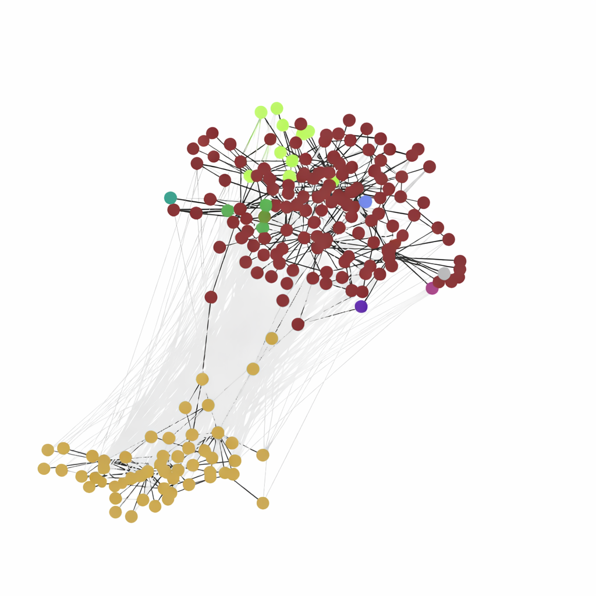

.. raw:: html

   <h1 style="text-align: center; font-size: 2.625rem;">LanguageChange documentation</h1>

LanguageChange is a Python toolkit for exploring lexical semantic change across corpora and time. 
It bundles data loaders, embedding pipelines, alignment strategies, and evaluation utilities so you can 
go from raw corpora to change scores and visual analyses in a single workflow. More specifically, the library provides:

- Ready-to-use benchmarks (SemEval 2020 Task 1, DWUG) plus helpers for your own corpora.
- Static and contextualised representation pipelines (count, PPMI, SVD, transformer-based) with caching.
- Alignment and comparison utilities (e.g. Orthogonal Procrustes) and standard change metrics such as PRT and APD.
- Plotting helpers for DWUG graphs and embeddings to inspect model behaviour visually.

To get started check out our :ref:`source/tutorials/kvinna`, which shows how to use the package to analyze the 
semantic change of the word "kvinna" (Swedish for "woman") over more than 100 years. 

For more details on how to use the library, check our reference API:

.. toctree::
   :maxdepth: 2
   :caption: Contents:

   source/api/languagechange
   source/tutorials/kvinna

Indices and tables
==================

* :ref:`genindex`
* :ref:`modindex`
* :ref:`search`

Source code
==================

The source code for this project is available on GitHub: https://github.com/ChangeIsKey/languagechange/.

Credits
==================

This project is maintained by the ChangeIsKey team with support from Riksbankens Jubileumsfond (grant M21-0021). 
The library is under active development, but íf it supports your research, please cite it as:

@misc{languagechange,
  title = {LanguageChange: A Python library for studying semantic change},
  author = {{Change is Key!}},
  year = {n.d.}
}
