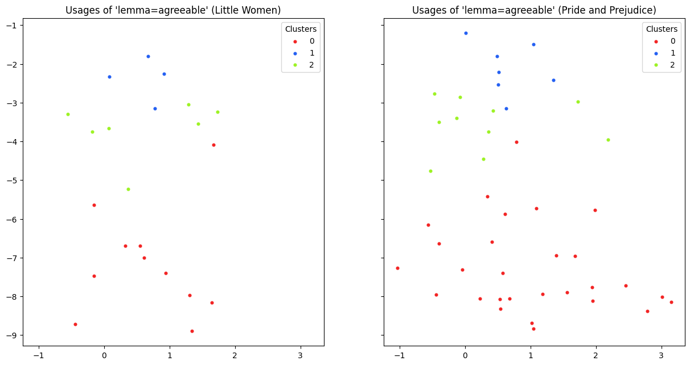

.. _source/tutorials/isle:

=========================================================
Tutorial: Comparing lexical variation between two novels
=========================================================

This tutorial uses the lexical semantic pipeline in the LanguageChange library to compare *Pride and Prejudice* (1813) and *Little Women* (1868) to study how the adjective *agreeable* is used across the two novels. It goes from loading the corpora, to searching for the target word, to running the pipeline, and finally to visualizing the results.

To reproduce the tutorial, run the notebook available in the ``notebooks`` directory of the repository. The data used in this tutorial can be downloaded from project Gutenberg: `Pride and Prejudice <https://www.gutenberg.org/cache/epub/1342/pg1342.txt>`_ and `Little Women <https://www.gutenberg.org/cache/epub/514/pg514.txt>`_.

However, feel free to use any other novels or target words of your choice! The tutorial is meant to be a compact workflow for comparing lexical variation between two texts, and can be adapted to other settings as needed.

Load the two novels
-------------------

Here we load the two novels as separate corpora, and assign them their respective publication years as time information.

.. code-block:: python

   from pathlib import Path

   from languagechange.corpora import HistoricalCorpus, LinebyLineCorpus
   from languagechange.utils import LiteralTime

   target = "agreeable"
   corpus_dir = Path("corpora")

   pp_corpus = LinebyLineCorpus(
      str(corpus_dir / "pp-tokens-lemmas.txt"),
      language="english",
      is_tokenized=True,
      is_lemmatized=True,
      time=LiteralTime("1813"),
   )
   lw_corpus = LinebyLineCorpus(
      str(corpus_dir / "lw-tokens-lemmas.txt"),
      language="english",
      is_tokenized=True,
      is_lemmatized=True,
      time=LiteralTime("1868"),
   )

   novels = HistoricalCorpus([pp_corpus, lw_corpus])

Search for the target word
--------------------------

Search by lemma so that all inflectional variants are grouped together:

.. code-block:: python

   from languagechange.search import SearchTerm

   search_term = SearchTerm(lemma=target)
   term = str(search_term)

   pp_usages = pp_corpus.search(search_term)
   lw_usages = lw_corpus.search(search_term)

   print(f"Pride and Prejudice (1813): {len(pp_usages[term])}")
   print(f"Little Women (1868): {len(lw_usages[term])}")

On the notebook data this gives:

.. code-block:: text

   Pride and Prejudice (1813): 45
   Little Women (1868): 22

Next, sample usages and store them in the domain structure expected by the
pipeline. Here the two domains are simply the two novels. This step is not necessary for this data, but if you have a lot of usages, it can be useful to sample a subset of them for the pipeline. The sampling function also allows you to sample usages per time period, which can be useful if you have more fine-grained time information.

.. code-block:: python

   from languagechange.utils import LiteralTime

   novel_comparison_usages = {
      term: {
         "Pride and Prejudice": pp_usages[term].sample_per_time(
            times=[LiteralTime("1813")],
            n_samples=100,
         ),
         "Little Women": lw_usages[term].sample_per_time(
            times=[LiteralTime("1868")],
            n_samples=100,
         ),
      }
   }

Run the comparison pipeline
---------------------------

Encode the usages with XL-LEXEME, cluster them, and compare the two novels as
separate domains:

.. code-block:: python

   import torch
   from sklearn.cluster import AgglomerativeClustering

   from languagechange.models.change.metrics import JSD
   from languagechange.models.representation.contextualized import XL_LEXEME
   from languagechange.pipeline import CDPipeline

   device = "cuda" if torch.cuda.is_available() else "cpu"

   model = XL_LEXEME(device=device)
   clustering_algorithm = AgglomerativeClustering(
      n_clusters=None,
      distance_threshold=0.5,
      linkage="complete",
      metric="cosine",
   )
   metric = JSD()

   pipeline = CDPipeline(
      novel_comparison_usages,
      model,
      metric,
      clustering_algorithm,
   )

   sampled, embeddings, cluster_labels, change_scores = (
      pipeline.run_pipeline()
   )

Visualize the two novels
------------------------

Plot the embeddings for each novel:

.. code-block:: python

   from languagechange.visualization import Visualizer

   visualizer = Visualizer(
      usages=sampled[term],
      embeddings=embeddings[term],
      cluster_labels=cluster_labels[term],
      target=term,
   )

   visualizer.plot_usage_embeddings()

The visualization for the two novels looks like this:

Inspect example usages
----------------------

We can then inspect usages from the clusters:

.. code-block:: python

   visualizer.display_usages(max_usages=10, randomize=True)

Looking at example sentences per cluster makes it easier to interpret what
kinds of contexts define each group. For example, cluster 0 seems to be more aligned with "agreeable" in the sense of being an accomplished social person, while cluster 1 and 2 are more related to "agreeable" in the sense of something being an acceptable situation.

Cluster 0

.. code-block:: markdown

   1813: Her fellow - travellers the next day , were not of a kind to make her think him less **agreeable** .
   
   1813: " I dare say you will find him very **agreeable** . "
   
   1813: His pride never deserts him ; but with the rich , he is liberal - minded , just , sincere , rational , 
   honourable , and perhaps **agreeable** , -- allowing something for fortune and figure . "
   
   1868: " I merely intend to make myself entrancingly **agreeable** to every one I know , and to keep them in your corner as long as possible .
   
   1813: She could not think of Darcy 's leaving Kent , without remembering that his cousin was to go with him ; but Colonel Fitzwilliam had made it clear that he had no intentions at all , and **agreeable** as he was , she did not mean to be unhappy about him .

Cluster 1

.. code-block:: markdown

   1868: The little girls , however , considered it a most **agreeable** and interesting event ...

   1813: " It has been a very **agreeable** day , " said Miss Bennet to Elizabeth .
   
   1813: is not this an **agreeable** surprise ? "
   
   1868: ... but the impulse that wrought this **agreeable** change was the result of one of the new impressions ...
   
   1813: It must have been a most **agreeable** surprise to Mr. Bingley ...
   
   1868: ... two **agreeable** things , which made her feel unusually elegant and ladylike .

Cluster 2

.. code-block:: markdown

   1813: His ease and cheerfulness rendered him a most **agreeable** addition to their evening party ...
   
   1813: But there is one of her sisters sitting down just behind you, who is very pretty, and I dare say, very **agreeable**.
   
   1868: ... two **agreeable** things, which made her feel unusually elegant and ladylike.
   
   1868: Fred is very entertaining, and is altogether the most **agreeable** young man I ever knew ...

Having model automatically create these clusters can help us discover patterns of usages that otherwise might not have noticed.