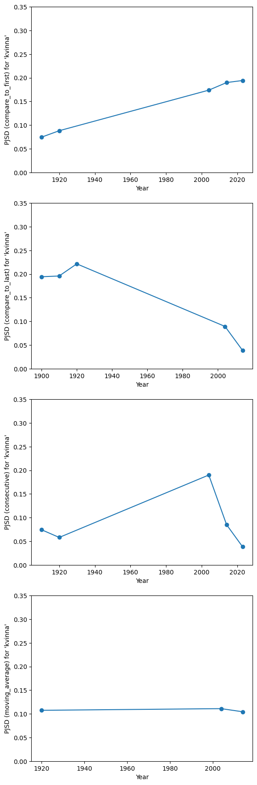
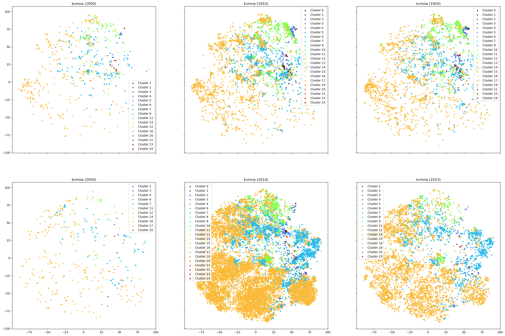

.. _source/tutorials/kvinna:
=========================
Tutorial: using the lexical semantic change pipeline
=========================

This tutorial walks through the lexical semantic change pipeline provided by the library to trace how a word’s usage evolves across time.
We focus on *kvinna* (Swedish for “woman”) and compare the 1900–1930 newspaper reports with modern news data from 2004–2023.

---------------

Loading and converting the corpora
--------------------------------
We select three corpora released by Språkbanken from 1900–1930 (Kubhist) and three from 2004–2024 (SVT). Download the XML data with:

.. code-block:: bash

   base=https://spraakbanken.gu.se/resurser/meningsmangder
   files=(
      kubhist-dalpilen-1900.xml.bz2
      kubhist-dalpilen-1910.xml.bz2
      kubhist-dalpilen-1920.xml.bz2
      svt-2004.xml.bz2
      svt-2014.xml.bz2
      svt-2023.xml.bz2
   )
   for file in "${files[@]}"; do
      wget "${base}/${file}"
   done

Since the corpora are in XML format, we first convert them to tab-separated vertical corpora for quicker search.

.. code-block:: python

   import os
   from languagechange.corpora import (
      SprakBankenCorpus,
      VerticalCorpus,
      HistoricalCorpus,
   )

   target = "kvinna"

   corpus_dir = "../corpora" # your corpus directory
   corpus_paths = [
      "kubhist-dalpilen-1900.xml",
      "kubhist-dalpilen-1910.xml",
      "kubhist-dalpilen-1920.xml",
      "svt-2004.xml",
      "svt-2014.xml",
      "svt-2023.xml"
   ]

   year_labels = [
      1900,
      1910,
      1920,
      2004,
      2014,
      2023
   ]

   corpus_list = []
   for p, year in zip(corpus_paths, year_labels):
      corpus_path = os.path.join(corpus_dir, p)
      corpus = SprakBankenCorpus(corpus_path)
      vertical_corpus = VerticalCorpus(
         corpus_path.replace(".xml", ".txt"), 
         time=year
      )
      corpus.cast_to_vertical(vertical_corpus)
      corpus_list.append(vertical_corpus)

   corpora = HistoricalCorpus(corpus_list)

Searching for usages of "kvinna"
--------------------------------

We can search through all corpora at once, getting all lemma-based usages of "kvinna" along with their timestamps so we can compare how the word is used in each period.

.. code-block:: python

   from languagechange.search import SearchTerm

   search_terms = [SearchTerm(target, word_feature='lemma')]
   usages = corpora.search(search_terms)

.. code-block:: bash

   2026-02-10 11:08:23,077 - root - INFO - 644 usages found.
   2026-02-10 11:08:45,754 - root - INFO - 3585 usages found.
   2026-02-10 11:09:02,286 - root - INFO - 2876 usages found.
   2026-02-10 11:09:02,652 - root - INFO - 390 usages found.
   2026-02-10 11:09:15,806 - root - INFO - 19386 usages found.
   2026-02-10 11:09:21,931 - root - INFO - 5862 usages found.

.. code-block:: python

   usages_per_year = dict()
   for year in year_labels:
      usages_per_year[year] = [
         usage
         for usage in usages["kvinna"]
         if usage.time == year
      ]

By organizing the usages by timestamp, we can later compare embeddings and sense distributions for each year without mixing the periods.

Encode usages into embeddings
--------------------------------

We encode all usages using XL-LEXEME to get embeddings for every instance of the word.

.. code-block:: python

   from languagechange.models.representation.contextualized import XL_LEXEME

   usage_encoder = XL_LEXEME()

   embeddings_per_year = dict()
   for year, usages in usages_per_year.items():
      embeddings = usage_encoder.encode(usages)
      embeddings_per_year[year] = embeddings

These contextualized vectors feed the clustering stage so similar usage patterns end up together.

Clustering embeddings into word senses
--------------------------------

To find the different senses of the word, we cluster all embeddings together, using agglomerative clustering. 
If the clustering is good, each cluster should correspond to one sense of the word.

.. code-block:: python

   import numpy as np
   from sklearn.cluster import AgglomerativeClustering
   from languagechange.models.meaning.clustering import Clustering

   all_usages = []
   for usage in usages_per_year.values():
      all_usages.extend(usage)
   embeddings_list = [embeddings_per_year[year] for year in year_labels]
   all_embeddings = []
   for emb in embeddings_list:
      all_embeddings.extend(emb)

   d = 0.6
   cluster_algo = Clustering(
      AgglomerativeClustering(
         n_clusters=None,
         metric='cosine',
         distance_threshold=d,
         linkage='complete',
      )
   )
   clustering_results = cluster_algo.get_cluster_results(all_embeddings)
   cluster_labels = clustering_results.labels

   indices = np.concatenate(
      ([0], np.cumsum([len(e) for e in embeddings_list]))
   )
   n_time_periods = len(embeddings_list)

   labels_list = []
   for t in range(n_time_periods):
      labels_list.append(cluster_labels[indices[t]:indices[t+1]])

With those label sequences, every period now has its own cluster history that we can compare using standard language change metrics.

Measure lexical semantic change with PJSD
--------------------------------

We use PJSD (Probability Jensen-Shannon divergence) to quantify how the cluster distribution for *kvinna* shifts between time points. PJSD compares two probability distributions, so it naturally captures changes in sense proportions without being sensitive to ordering.
We can try different `timeseries_type` configurations on the resulting label sequences, such as comparing each distribution to the previous one ("consecutive"), to the first snapshot ("compare_to_first"), to the last ("compare_to_last"), or computing a "moving_average" over multiple windows.

.. code-block:: python

   from languagechange.models.change.timeseries import TimeSeries
   import matplotlib.pyplot as plt

   ts_types = [
      'compare_to_first',
      'compare_to_last',
      'consecutive',
      'moving_average',
   ]
   for ts_type in ts_types:
      timeseries_from_embs = TimeSeries(
         cluster_labels=labels_list,
         change_metric='pjsd',
         timeseries_type=ts_type,
         time_labels=year_labels,
      )
      plt.figure()
      plt.ylim(ymin=0, ymax=0.35)
      plt.xlabel("Year")
      plt.ylabel(f"PJSD ({ts_type}) for '{target}'")
      plt.plot(
         timeseries_from_embs.ts,
         timeseries_from_embs.series,
         marker='o',
      )

The “consecutive” plot shows the largest jump between the 1920s and the 2000s, which tracks the largest chronological gap in our sampling and points to a major shift in usage around the turn of the century.

Plot word sense clusters across time
--------------------------------

We can also visualize the embeddings for each period with their assigned cluster labels so we can sanity-check whether similar senses stay grouped and how the cluster layout shifts across time:

.. code-block:: python

   import math
   import numpy as np
   import matplotlib as mpl
   import matplotlib.pyplot as plt
   from sklearn.manifold import TSNE

   reduced_embs = TSNE(
      n_components=2,
      learning_rate='auto',
      init='random',
   ).fit_transform(np.array(all_embeddings))

   cols = 3
   fig, axs = plt.subplots(ncols=cols, nrows=2, sharex = True, sharey = True)

   W = 30
   H = W * math.ceil(n_time_periods/cols) / cols

   fig.set_figwidth(W)
   fig.set_figheight(H)

   unique_clusters, counts = np.unique(cluster_labels, return_counts=True)

   cmap = plt.cm.turbo
   norm = mpl.colors.Normalize(
      vmin=unique_clusters.min(),
      vmax=unique_clusters.max(),
   )
   scalar_map = mpl.cm.ScalarMappable(norm=norm, cmap=cmap)

   for t in range(n_time_periods):
      ax = axs[t // cols][t % cols]
      period_cluster_labels = labels_list[t]
      period_reduced_embs = reduced_embs[indices[t]:indices[t+1]]
      for i, label in enumerate(np.unique(period_cluster_labels)):
         cluster_embs = period_reduced_embs[
            np.where(period_cluster_labels == label)
         ]
         x = cluster_embs[:,0]
         y = cluster_embs[:,1]
         ax.scatter(
            x,
            y,
            c=[scalar_map.to_rgba(label)],
            s=10,
            label=f"Cluster {int(label)}",
         )
      ax.legend()
      ax.set_title(f'{target} ({year_labels[t]})')

Let's inspect some example sentences that belong to each cluster, along with the year they occurred, so we can read the contexts that drive each sense.

.. code-block:: python

   import numpy as np
   from IPython.display import Markdown, display

   def text_formatting(usage, time_label):
         start, end = usage.offsets
         formatted_text = (
            f"{time_label}:\t"
            + usage[:start]
            + "**"
            + usage[start:end]
            + "**"
            + usage[end:]
         )
         return formatted_text

   # Use to display usages of all time periods, sorted per cluster
   def display_cluster_usages(
      usages,
      labels,
      max_per_cluster=None,
      randomize=False,
   ):
      label_usage_dict = {}
      for i, label in enumerate(labels):
         if label not in label_usage_dict:
               label_usage_dict[label] = []
         label_usage_dict[label].append(i)
      for c in sorted(label_usage_dict):
         print(f'Cluster {int(c)}:')
         if max_per_cluster == None:
               for i in label_usage_dict[c]:
                  display(
                     Markdown(
                        text_formatting(usages[i], usages[i].time)
                     )
                  )
         else:
               if randomize:
                  choices = np.random.choice(
                     label_usage_dict[c],
                     min(max_per_cluster, len(label_usage_dict[c])),
                     replace=False,
                  )
                  for i in choices:
                     display(
                        Markdown(
                           text_formatting(usages[i], usages[i].time)
                        )
                     )
               else:
                  for i in label_usage_dict[c][:max_per_cluster]:
                     display(
                        Markdown(
                           text_formatting(usages[i], usages[i].time)
                        )
                     )
         print('----------------------------')

   display_cluster_usages(
      all_usages,
      cluster_labels,
      max_per_cluster=10,
      randomize=True,
   )

The helper prints a heading for each cluster and uses Markdown to highlight the target word, while the `max_per_cluster` / `randomize` arguments keep the output manageable and varied.

.. code-block:: markdown

   Cluster 0:

   2014: Två hundar har specialutbildats och bor nu hos två kvinnor .

   2014: Kvinna dog efter felmedicinering

   1920: 25,83 procent av valmän och kvinnor mötte upp vid valurnan .

   1920: Dryckenskspen ekar t. o. m . uland kvinnorna cch ttnytlomen .

   1910: Kvinnor och ban lö des först och fämst i båtarna .

   2014: Kvinnan har nu till den 26 oktober på sig att flytta fågeln .

   2014: Projektet startade den 1 januari i år och de två hundarna har bott med respektive kvinna i några veckor .

   1920: 1922 . att häst , för att kvinna antagas , skall vara fullt inkörd och tjänstbar samt

   1910: Den mast resoluta af dem visade , att beslut och handung äro att boa kvinnan .

   1910: Dtt kan ju hända att det går en kvinna inne hos kossorna och stökar , men annars.tyder allt på sömn och död .

   ----------------------------
   Cluster 1:
   1910: Fd mänga kvinnor ära andra , synpunkt . ' !

   1910: skuttets försktg till 50 ört för man oc ' " dö Cro för kvinna .

   1920: Vad hai kvinnan att vinna i riksdagen , som hon icke kan vinna på annan väg ?

   1910: Det lägsta beloppet för kvinna ha : varit kr .

   2023: Mannen har krävt kvinnan på 10 000 kronor då hon enligt honom inte uppfyllt ” sin del av avtalet ” .

   1910: Domaren .. tillerkindo kvinnan 100 dol&rs .

   1910: Gift kvinnas kommunala rösträtt .

   1920: kvinnor summa kr .

   2014: I Västernorrland har kvinnorna ett sjukpenningtal på 13 dagar och männen sju .

   1910: Kvinnor , som halva kommunal rösträtt .

   ----------------------------
   Cluster 2:
   1920: i kvinnan .

   2014: Kvinnan klämdes fast och fick skäras loss .

   1910: Kvinnor från de stridande !

   2014: Mannen hade slagit kvinnan så att hon hade fått märken i ansiktet .

   2023: Mannen ska enligt åtalet ha tagit strypgrepp och slagit kvinnan flera gånger samt tryckt ner henne på golvet och spottat på henne .

   1910: ■ Kvinnan » .

   1910: er a / för iSpörfmäl » , » Från bemmels och kvinnans väridi

   1910: de fcdi f.>rtjus.inde kvinna .

   1910: Alla tr.dfade kvinnan .

   2014: Rånade och sparkade kvinna i huvudet

   ----------------------------
   Cluster 3:
   1910: Ansökningar finnas f. n . inne frän 100 män ocli 23 kvinnor .

   2014: Kandidater är sju män och en kvinna som utsetts i ett särskilt nomineringsval .

   1920: Församlingen har alltså ökat med 13 män och minskat med 2 kvinnor .

   1900: 1 Göteborg anmälde sig 1.029 män ^eli 71 kvinnor .

   2014: På SM i somras så var det fler kvinnor än män anmälda , något som aldrig hänt innan .

   1910: I en mängd artiklar i oppositionens tidningar har framhållits , att partiledningen med hr Branting i spetsen fått majoritet * — dock icke mer vad valmännen och kvinnorna försias beträffar än ungefär 60 proc .

   1910: 1 allt hava alltså §78 nian , och # 44 kvinnor eller sammanlagt 1 , 122 , jp§rr röner begagnat sig av sin rösträtt .

   1920: Antalet röstberättigade män utgjorde 67,865 och röstberättigade kvinnor 69 , 621 .

   1910: Exspektanter voro 185 ( 135 min och 50 kvinnor ) .

   2014: Det handlar om otroligt vältränade idrottsmän och kvinnor som genomlidit massor med timmar av träning för just den här matchen .

   ----------------------------
   Cluster 4:
   2014: På första plats i Forbes lista över världens mäktigaste kvinnor finns Tysklands förbundskansler Angela Merkel .

   2014: Kvinnan uppger att hon under dagen och kvällen varit ensam hemma med de tre barnen .

   2014: Många i favelan delar ett liknande öde , det är kvinnorna som styr .

   2014: De ifrågasätter hur frågan i undersökningen egentligen ställts eller underkänner kvinnornas tolkning av deras taktiker .

   1920: lerna oeh bondeförbundet har många män och 125 kvinnor eller sammanlagt förespråkare .

   2023: Två kvinnor i en kulturförening i Sundsvall döms för grovt bedrägeri .

   2014: Samtliga tre var anställda av assistansbolaget STIL och jobbade som personliga assistenter hos kvinnan .

   2014: Man hotade döda kvinnas ofödda barn

   2023: Här rusar kvinnan fram med brandsläckare under koranbränningen i Stockholm

   1910: Hvar söker du månne din lika , du ädlaste kvinna i SverigaB rike , du mxler till Svithiods starkaete

   ----------------------------
   Cluster 5:
   1910: Dessutom föredrogs af samme man eu annan dikt : » Kvinnan för kvinnor » .

   1910: I r : innells sångkör bi Irog m ■ lan talen med några t .st rländska nummer förutom Kvinnornas lö:T-n .

   2023: Kanadensiska Miriam Toews förra roman , ” Kvinnor som pratar ” , utspelade sig i en religiös sekt i Bolivia där kvinnor inte fick läsa eller skriva och där de dag och natt utsattes för övergrepp av gruppens män .

   2023: På nöjesparkens mindre scen har man i nuläget presenterat fyra kvinnliga akter , totalt rör det sig om nio kvinnor .

   1920: kvinnorna ' ' av Anna Lindhagen :

   1900: På middagen spelades ett folkskådespel af iransk exträktion , » Kvinnan af folket » .

   ----------------------------
   Cluster 6:
   1920: D i vet ju , att en kvinna aldrig ! .

   2014: Många av dem präglas av krig och konflikter – i vissa löper kvinnor och barn större risk att dö än de stridande soldaterna .

   2014: Knivhotade kvinna

   2023: Säkerhetsrådet fördömer också talibanernas förbud mot kvinnor att arbeta för FN , ett förbud som enligt resolutionen saknar motstycke i FN:s historia .

   2014: Kvinna påkörd av lastbil

   1920: Det var en kärngumma , rom mati säger , an kvinna letlrad under de tecken .

   2014: Andelen kvinnor var 30 procent eller lägre i de flesta av länderna , och andelen minskar .

   2023: Kartlade kvinnans vanor

   1910: erinrande om stenens resande för ett tiotal år sedan och hvarom den minde såväl St Skedvi .socknemän som hvarje svensk man och kvinna , som hade sin väg förbi .

   2014: Kvinnor som får vänta så länge på hjälp att de kissar på sig .

   ----------------------------
   Cluster 7:
   1920: Kvinnor !

   2014: Det är gratis och man blir lite vackrare och känner sig som en kvinna , säger hon .

   1920: Kvinnor !

   1920: Kvinnor !

   1910: Kvinnan , som !

   1920: Kvinnor !

   1920: Vilken kvinna

   1910: Dalabygdens män och kvinnor !

   1910: — I så fall är hon väl en god kvinna och jag ' föritår icka varför du förutsätter att hon skulleavara motsatsen .

   1910: Ursäkta , han vände sig nu själf till kvinnan , är det bekant om klockare Fogdegård möjligen var frän Smaland , om han gått i Växiö skola ?

   ----------------------------
   Cluster 8:
   1900: två kvinnor , lågo och Bofvo .

   1910: Kvinnorna / A vä ' Ja riksdegsmän 1921 »

   1910: mannens och 12 genom kvinnans di«i . )

   1920: Sä trädde Kvinnan : n oeh itiirile ' .

   1910: I demonstrationen de !torp uteslutande kvinnor .

   2023: Det innebär att endast 12 personer är kvinnor av de 90 akter – det vill säga band , soloartister och duor – som framför listans 100 låtar .

   1910: e ) att den årsinkomst i kontanter och naturaförmåner , sökande kan anses tills vidare komma att åtnjuta , icke öfverstiger 270 kronor för man och 256 kronor ISr kvinna ;

   1920: j tal män cch kvinnor .

   2014: Kyrkoherden är chef för hela församlingen och av de sju prästtjänsterna som finns i dag är två kvinnor .

   1910: Hospitalspatienterna ära 407 män och 38.S kvinnor .

   ----------------------------
   Cluster 9:
   2023: När Gitte ringer ” Telenor ” berättar kvinnan att en iPhone skickats till en adress där Gitte Pålsson inte bor .

   2023: Kvinnan på försäkringsbolaget såg till att ersättningen betalades ut till kunderna .

   2014: Kvinnan ska inte ha gett katterna tillräckligt med mat och vatten .

   2014: - Och då blir det ett polisiärt ärende eftersom de har större resurser sa Migrationsverkets kvinna .

   2014: Kvinnan har nu förelagts att klippa alla hundarnas klor regelbundet och att rasta dem utomhus .

   ----------------------------
   Cluster 10:
   1910: de särskilt inbjudna , av vilka flertalet fi ån firmans personal , tagit plats i- <fe gammalmodiga kyiktänk3r » ia , kvinnorna för sig på vänstra sidan och männen till höga: .

   2014: Där klarar kvinnorna sig lika bra som männen .

   2014: När Statistisk årsbok startade gifte män och kvinnor sig genomsnittligen när de var 27 respektive 30 år .

   1920: Skrämd av detta sökte kvinnan sig ut ur lägenheten en annan väg för att kalla på hjälp .

   2014: Då flydde kvinnan landet .

   2014: Efter att ha vårdats på sjukhus lämnade kvinnorna frivilligt vården .

   1920: Kvinnan av i dag

   2014: När de skulle undersöka området hunden vistades på hindrade och nekade kvinnan kontrollanterna .

   2014: Efter samlaget sprang kvinnan från lägenheten utan att hinna få med sig alla kläder .

   2014: Männen stannar – kvinnorna flyttar

   ----------------------------
   Cluster 11:
   2023: Under torsdagen väcktes åtal mot en man och en kvinna vid Örebro tingsrätt .

   2014: En man och en kvinna blev fastklämda i bilen .

   2014: Forskare från Harvard fann att kvinnor som fick i sig mycket av dessa livsmedel löpte 29 till 41 procent större risk att drabbas av depression än de med en mindre inflammationsdrivande kost , skriver Svenska Dagbladet .

   1920: dtc män och kvinnor över 18 ir .

   2014: ” Målet är en jämn fördelning mellan kvinnor och män när det gäller högre chefer .

   2014: I den senaste mätningen visade det sig att 63 procent av kvinnorna hade hört talas om testet men bara 48 procent av männen .

   1900: De hade jämnat vägen till förståelse mellan man och kvinna , och det skulle också kvinnorna komma ihåg , när de kommit sa långt , att de sta med rösträttssedeln i hand .

   2014: – De här resultaten visar att psykisk stress påverkar den kardiovaskulära hälsan olika hos män och kvinnor .

   2014: Region Gotland kritiseras av Diskrimineringsombudsmannen ( DO ) för otillräcklig analys av löneskillnaderna mellan kvinnor och män .

   1910: da striden gäller ungdomens styrka pch framtid hetare än någonsin , är det hvar klarsynt och tänkande gosses och flickas , mans och kvinnas plikt att hjälpa nykterhetsfolkct i den ridderliga kamp , som framför andra är en kamp för Sveriges frihet .

   ----------------------------
   Cluster 12:
   1910: Ärmu betänkligare är formuleringen af själfva petitionen , nämligen en anslutning till » krafvet på tull politisk medborgarerätt För Sveriges kvinnor » .

   1920: Speciellt inbjuda » de i l-kitu- stad arbetande kvinnoföreningarna : Vita bandet , Frisinnade kvinnor .

   2014: Karatch , som även var med och startade organisationen Kvinnor för fullt medborgarskap , anser att Vitryssland är allt för konservativt patriarkaliskt och att mycket är att vinna på mer jämställdhet mellan könen .

   1910: För att icke kvinnorna å någon ort må gå miste om möjligheten att , om ock i enklaste former , deltaga i denna opinionsyttring för freden , uppmanas intresserade kvinnor ä sådana orter , där möten ej förberedts , att omedelbart väntia sig till C en t ra 1 k o ni i t d n för kvinnornas f r e d s s ö n d a g , Eriksbergsgatan S B , Stockholm .

   1920: R . och föreningen Frisinnade kvinnor överlämnades av fröken V. Olander en elektrisk lampa av hamrat silver jämte en av fröken Ester Källström textad adress .

   2004: Men detta räcker inte för att bryta ” de patriarkala strukturerna ” , anser Ewa Larsson , ledamot i mp:s styrelse och tillfällig ordf. i Gröna kvinnor .

   1920: Svenska kvinnornas medborgarförbund , en politiskt intresserad , ehuru i partihänseende neutral sammanslutning , som i viss mån övertagit F. K .

   2014: Ofog Stockholm , Kvinnor för fred Stockholm och Stockholmsgruppen i Kristna fredsrörelsen stod bakom aktionen .

   1910: Regeringen har beviljat föreningen Kvinnorna och landet och Dalarnes försvarsförening vardera en dragning i de varulotterier varom båda föreningarna gjort ansökan .

   1920: Socialdemokrati ka Arbetarpartiets lista samlade 227 röster samt listan Frisinnade kvinnor 6 röster .

   ----------------------------
   Cluster 13:
   1910: 0,43 samt till skolan förutom personliga avgifter av 50 öre för man och 25 öre för kvinna kr .

   1920: s , ttstamenterade 10.0CO pund kvinna , som f >r en del år

   1910: Denna summa skulle uttaxeras dels genom personlig skatt med 50 öre rå man och 25 ort- rå kvinna samt dels med kr .

   1920: ' • ino " D.l " : 19 r- " - 1 orli 9 kvinnor .

   1920: avgitter erläggas av 892 mun och t-55 kvinnor .

   1910: och för 5,241 kvinnor ä 25 öre kr .

   1920: IoEijttEtc i:o : i 23 , kvinnor 1 ! ' .

   1910: Det gäller inordet pä en mi ' 4 kvinna .

   1920: Utféjttade : 41 txän ocli 70 kvinnor .

   1920: pj Tallbacken En kraftir och dhav 584 tr&n o:h 6Ö6 kvinnor In-

   ----------------------------
   Cluster 14:
   2014: I Europahusets panelsamtal om våld mot kvinnor ingår även Carina Ohlsson , ordförande Sveriges Kvinno- och Tjejjourers Riksförbund SKR , Martin Permén , Handläggare för brott i nära relation , Rikspolisstyrelsen , och Gun Heimer professor , överläkare och föreståndare för NCK .

   2014: Det visar statistik från Sveriges kvinno- och tjejjourers riksförbund .

   2014: Arrangörer är Sveriges Kvinno- och Tjejjourers Riksförbund , SKR , Vänsterpartiet , Grön Ungdom , Kurdiska ungdomsföreningen , Feministiskt initiativ , Kommunistiska Partiet , Varken hora eller kuvad .

   2023: På Roks kvinno- och tjejjourer möts de utsatta endast av kvinnor .

   1900: Kl. i ) på kvällen höll amanuensen E. Lundström från Stockholm ett anförande öfver » Ungdomen och nutiderörelserna » och talade därunder om ungdomens ställning till soiialdemokratien , freds- , kvinno- och nykterhetsrörelserna .

   2014: Målet med myndighetens granskning av de kvinno- respektive mansdominerade kommunala grenarna var att ta reda på varför kvinnor oftare är sjukskrivna än män .

   2023: – Vi är beroende av bidrag i vår förening , därför är vi tacksamma för alla pengar vi kan få in , säger Ann Norlin på kvinno- och ungdomsjouren i Kalmar .

   2014: En ny rapport från kvinnorättsorganisationen ” Kvinna till kvinna ” visar på en hårdnande tillvaro för de som arbetar för kvinnors rättigheter världen runt .

   2014: Det inkluderar , förhoppningsvis , en trygg finansiering , säger Olga Persson , förbundssekreterare för Sveriges Kvinno- och Tjejjourers Riksförbund till P4 Stockholm .

   2014: Bakom utställningen står bland annat föreningen Kvinna i Skaraborg och de hoppas att fotona också ska väcka andra frågor som berör kvinnor .

   ----------------------------
   Cluster 15:
   1910: Btftn och kvinnor !

   1920: : on att kvinnan vid ett tillfälle !

   2014: I måndagskväll publicerade Nyheter24 krönikan ” Var är kvinnorna Zlatan Ibrahimović ? ” .

   1920: T:s kvinn-

   1900: for kvinna och lägosäagsafgii ten skulle utgå med samma belopp som innevarande år .

   1920: Fyra män oeh tvä kvinnor tia ominimil genmii en bilolycka i det all : .

   1920: Anordnama hoppas nu it : kvinnor .- ; • talrik !

   1910: ; är internerad i ( in stianshavns fängelse t : r kvinnor .

   1910: Kvinnorna och potatis * ransoneringen .

   1910: for män oi-h kvinnor ttfyftsfritt för arbets gifvare och arbetssökande .

   ----------------------------
   Cluster 16:
   2014: Misshandeln ska enligt anmälan ha ägt rum i december och bestått i att en personal slog den äldre kvinnan i ansiktet och skällde på henne .

   1920: Medelålders hjärtegod KVINNA

   2014: Den drabbade kvinnan ska enligt polisen vara svårt medtagen av händelsen .

   2014: Forskare vid University of New South Wales i Australien , som också hade reagerat på skäggtrenden , lät 1 453 kvinnor och 213 män ranka bilder på män med fyra olika typer av ansiktsbehåring , från helskägg till slätrakade .

   2014: Det var på nyårsafton som mannen våldtog en kvinna i baksätet på sin bil .

   1910: Potatisåkrarre , spridda här och där , äro talrikt befolkade , mest med kvinnor och barn , men drillarnes antal synes nu ratt decimeradt ocli källarna börja i stället blifva väl fyllda , ty skörden af rotfrukter blir i år god här i mellersta Dalarne .

   2023: Bh:arna har samlats in under en längre tid , bland annat från de stödsökande kvinnorna och från kvinnojourens ideella medlemmar .

   1920: Onsdagen den 23 april fanns en cnsnmboendo kvinna , Klor-kur Margreta Karlsdotter i Lenåsen , lipgande död i sin -- : in<r .

   2014: Kvinnan är förd med ambulans till sjukhus och hennes skadeläge uppges vara allvarligt men stabilt .

   2014: En lyckselebo åtalas misstänkt för att via telefon ha ofredat en kvinna .

   ----------------------------
   Cluster 17:
   1920: betsstuga för att söka bereda kvinnor att „öl .

   2004: Sju kvinnor heter som julblomman Amaryllis och sex kvinnor heter Azalea .

   1920: Av ile tilltalade voro omkr. 000 kvinnor .

   1910: Dåraf voro 9,911 och 4,091 kvinnor , a rötmånadssvamp .

   2004: Sju kvinnor heter som julblomman Amaryllis och sex kvinnor heter Azalea .

   2014: Forskarna kan i dag visa att de varianter av viruset som sprids i Sierra Leone härstammar från de här kvinnorna .

   ----------------------------
   Cluster 18:
   2014: Rätten köper dock inte mannens förklaring och bedömer hans uppgifter som mindre trovärdiga än kvinnans .

   2014: Vid ett flertal tillfällen anmälde kvinnan mannen .

   2023: ” När han var klar förflyttade han sig till förarsätet igen och fortsatte att köra som om ingenting hänt ” , berättar en av kvinnorna i domen .

   2023: Tre män och en kvinna misstänktes 2021 vara inblandade i ett mordförsök , grov misshandel och grovt rån mot tre personer i Timrå .

   2014: Enligt hovrätten finns det risk för att kvinnan kan undanröja bevis .

   2023: Kvinnorna ska ha pekat ut 38-åringens före detta man som skyldig till branden men tingsrätten menade i sin dom att mannen inte kan ha varit på platsen när branden startade .

   2014: Kvinnan åberopade i samband med åtalet mot henne , det faktum att hennes sambo dömts till fängelse strax efter att händelsen inträffade .

   ----------------------------
   Cluster 19:
   1910: är din dygd , o kvinna , ?

   1920: Du unge man , da unga kvinna , tänd valhorysmässoflammors prakt !

   ----------------------------
   Cluster 20:
   2014: Samma positiva syn möter man hos det ledande oppositionspartiets starka kvinna , Karin Malmfjord ( S ) :

   2014: SVT:s USA-korrespondent Stefan Åsberg har träffat kvinnan bakom lagförslaget , en mor som betalat ett högt pris för en okoncentrerad bilförares framfart .

   2023: Linda Dahlin är tränare och kvinnan bakom det nya paralaget i innebandy .

   2014: – Nej för tidningen hade ju lika gärna kunnat skriva rubriken Maktens kvinnor eller Kvinnor i politiken .

   2014: På femte och sjätte plats dyker de första kvinnorna upp : Tysklands förbundskansler Angela Merkel och Janet Yellen , ordförande i den amerikanska centralbanken Federal Reserve .

   2004: Nyhetsbyrån Reuters sammanfattar listan över chefer för de 27 departe- menten med orden ” fler teknokrater , färre krigsherrar och tre kvinnor ” .

   2023: • Partikamraterna har inte fortsatt förtroende för kommunens starka kvinna –

   1900: Vidare synes det hr S. , som om den politiska kvinnan i sitt arbete icke skulle kunna frigöra sig från antagonismen mellan kören » äfven på områden som borde stå på sidan om kvmnospörsmålete .

   1910: Ar kvinnan stark , är folket mäktigt , mea faller hon , sa gar det utför mod nationen .

   ----------------------------
   Cluster 21:
   1920: Kvinnornas behörighet till statstjänst .

   2014: En kvinna på nio ledamöter

   1920: Kvinnornas tillträde till statstjänst .

   1910: Kvinnan tillerkändes fall giftorätt i mannens bo .

   1900: De engelska röstratts kvinnorna .

   1910: Kvinnor som halva kommunal rösträtt ,

   1920: Kvinnornas tillträde till statstjänster .

   1920: Kvinnors behörighet till statstjänst .

   ----------------------------
   Cluster 22:
   2014: Kvinnan fick sladd och en trafikolycka inträffade .

   2014: Föraren ska inte heller anpassat hastigheten eller lämnat företräde för kvinnan vid övergångsstället .

   2014: Men när väl kvinnorna får upp farten kanske hjulen börjar rulla snabbare .

   ----------------------------
   Cluster 23:
   2023: Mannen hade kartlagts kvinnans vanor för att kunna utföra attacken där det skulle finnas lite människor i omlopp .

   1910: dragen at kvinnornas arbetskraft .

   1920: Det kan inte vara en kristen man eller kvinna värdigt all tala om tn.iitning .

   1920: \ ' i uttala atl programchefens Man ma ju säga , atl påvens frivQ- ha konstaterat kvinnornas bristande

   1920: Den avlidnes modet är en av sorger mycket prövad kvinna .

   1920: varje ansvarskännande svensk man o ; h kvinna en bjudande plikt att här skänka sitt stöd .

   1910: sålunda i kvinno-

   1920: T .. 1 all lycka är emellertid sanningen på marsch , och detta tack vare kvinnan och det sunda förnuftet .

   1920: Gift kvinnas likställighet .

   1910: Klart flammande harm cch helig vrede skola fördubbla hyarje tysk mans och kvinnas kraft , likgiltigt din den helgats åt strid " , arbete eller ofiervillig försakelse .

   ----------------------------
   Cluster 24:
   1910: Kvinna / i stortinget .

   1910: - Som be sant har man i Tyskland invalt flera kvinnor { nationalförsamlin-

   1910: Med S5 röster mot 33 beslöt kammaren , ait kvinna sbu ' .

   1920: Att n:t , vid ett synnetligen viktigrt oeh piövande val , icke kvinna it öta fiam med bästa möjliga kandidatbesättning kan icke vara av got j .

   2014: – Vi har ju kvinnor och män som sitter i riksdagen , men det är ändå politikerna i Stockholm som bestämmer .

   2014: Linda Danielsson ( S ) är en av de två kvinnorna i Mullsjös kommunstyrelse .

   1900: .Valmännen ha då större möjligheter att öfverblicka de politiska och sociala följderna af en kombinering af maniens allmänna rösträtt med kvinnans .

   2014: Han föreslår nu att Vänsterpartiet väljer ett delat ledarskap för framtiden på årsmötet i mars , med en kvinna och en man .

   2014: Kommissionen består totalt av 19 män och nio kvinnor .

   2014: När det stora flertalet av kommunerna i Sverige verka ha svårt att få till jämställda kommunstyrelser sticker Mörbylånga på Öland ut – här är det kvinnorna som regerar .

   ----------------------------
